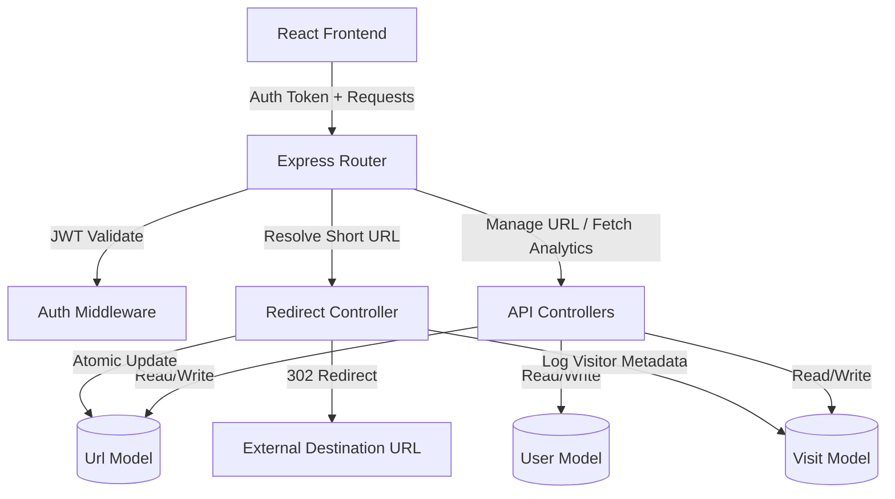

# TrimLink: Production-Ready URL Shortener with Analytics

TrimLink is a modern, high-performance, full-stack URL Shortener application built using Node.js, Express, MongoDB, React, Vite, and Tailwind CSS. It features JWT-based authentication, user-specific URL dashboard management, server-side click analytics tracking, and graphical metrics displays (including click trends, device breakdown, browser types, and country geolocations).

## Features

- **JWT Authentication**: User signup, login, and token-based protected route gates.
- **Link Shortening**: Generate secure, unique short links using base62 encoding.
- **Custom Aliases**: Users can supply their own custom slugs for URLs.
- **Link Expiration**: Schedule links to automatically expire at a designated date and time.
- **Atomic Clicks Tracker**: Real-time redirections increment click counts atomically.
- **Advanced Visitor Analytics**: Track browser names, client devices, operating systems, and geographical sources.
- **Data Visualizations**: Beautiful interactive graphs mapping click metrics.
- **Downloadable QR Codes**: Generate downloadable QR codes linking directly to the shortened URLs.
- **Responsive Theme**: Premium, mobile-responsive dark glassmorphism design system.

---

## Technical Architecture



---

## Installation & Setup

### Prerequisites
- Node.js (v18.x or later)
- MongoDB installed locally OR a MongoDB Atlas cloud URI

### 1. Backend Configuration
1. Navigate to the backend directory:
   ```bash
   cd backend
   ```
2. Install packages:
   ```bash
   npm install
   ```
3. Create a `.env` file from the example:
   ```bash
   cp .env.example .env
   ```
4. Verify environmental configs in `.env`:
   - `PORT=5000`
   - `MONGODB_URI=mongodb://127.0.0.1:27017/url-shortener`
   - `JWT_SECRET=super_secret_jwt_key_12345`
   - `CLIENT_URL=http://localhost:5173`
5. Start development hot-reloads:
   ```bash
   npm run dev
   ```

### 2. Frontend Configuration
1. Navigate to the frontend directory:
   ```bash
   cd ../frontend
   ```
2. Install packages:
   ```bash
   npm install
   ```
3. Start development server:
   ```bash
   npm run dev
   ```
4. Access the web interface at: `http://localhost:5173`

---

## API Documentation

### Auth Endpoints
- `POST /api/auth/register` - Register a new user account.
- `POST /api/auth/login` - Authenticate existing credentials.
- `GET /api/auth/me` - Fetch profile session data (Protected).

### URL Endpoints
- `POST /api/urls` - Create a short URL (Protected). Supports optional `alias` and `expiresAt` inputs.
- `GET /api/urls` - List URLs created by the caller (Protected).
- `GET /api/urls/:id` - Fetch single link configuration (Protected).
- `DELETE /api/urls/:id` - Delete link mapping and visitor logs (Protected).

### Analytics Endpoints
- `GET /api/analytics/dashboard` - Get overall stats metrics (Protected).
- `GET /api/analytics/url/:id` - Get detailed click metrics, historical log table, and chart inputs (Protected).

### Direct Redirection Route
- `GET /:shortUrl` - Resolves mapping, asynchronously registers analytics, updates atomic counters, and returns a `302 Found` header directing the client's browser to the destination URL.

---

## Deployment Guide

### Database (MongoDB Atlas)
1. Register a free tier on MongoDB Atlas.
2. Spin up a Shared Cluster and create a database user (username + password).
3. Whitelist access IP addresses (`0.0.0.0/0` for cloud deployments).
4. Extract the connection string and update the `MONGODB_URI` environment variable.

### Backend Hosting (Render / Railway / Heroku)
1. Push code to a GitHub repository.
2. Link your repository to a service provider (e.g. Render Web Services).
3. Set base configuration:
   - Build command: `npm install`
   - Start command: `npm start` (Runs `node src/app.js`)
4. Add Environmental Variable fields corresponding to the `.env` settings.
5. Extract the assigned service URL (e.g., `https://api.trimlink.com`) to configure client CORS.

### Frontend Hosting (Vercel / Netlify)
1. Bind your repository to the hosting dashboard.
2. Set configuration properties:
   - Framework preset: `Vite`
   - Output directory: `dist`
   - Build command: `npm run build`
3. Configure the `VITE_API_URL` environment variable pointing to the deployed backend endpoint.
4. Set URL rewrites/redirect rules for client-side routing fallback (e.g. Vercel `vercel.json` config redirecting missing pages back to `/index.html`).
